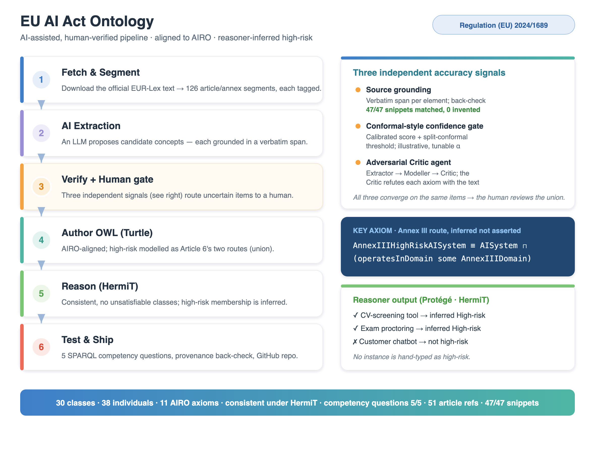

#  EU AI Act Ontology (proof of concept)


**Dr Zhaoxing Li** &nbsp; [](https://zhaoxing-li.github.io/) [](https://orcid.org/0000-0003-3560-3461) [](https://scholar.google.com/citations?user=2fqD3zUAAAAJ&hl=en)



I built a proof-of-concept ontology of the core of **Regulation (EU) 2024/1689
(the EU AI Act)** — AI system categories, prohibited practices, high-risk systems,
core actors, risk tiers, Annex III domains, and the major obligations — with an
**AI-assisted, human-verified pipeline**, aligned to the **AI Risk Ontology (AIRO)**.

The part I think is novel is *how I keep an LLM-driven pipeline trustworthy*.
Instead of hand-set rules, the decision of **what a human reviews** is driven by
two methods I rarely see applied to ontology engineering: an **illustrative
conformal-style confidence gate** (uncertainty quantification giving a
distribution-free coverage statement under the stated calibration setup — a proof
of concept, not a guarantee of legal correctness) and an **adversarial Extractor →
Modeller → Critic multi-agent loop**, where a Critic agent tries to *refute* each
axiom against the source text. Together with verbatim source-grounding, these give
**three independent accuracy signals that converge** on the same items — and the
Critic even caught an issue the other two missed.

The headline modelling choice is symbolic: `HighRiskAISystem` is a **defined
class**, so a reasoner *infers* which systems are high-risk — nothing is
hand-asserted. Generation moves fast; the reasoning stays verifiable.

**Jump to:** [Submission checklist](#submission-checklist) · [Highlights](#highlights) · [Repository map](#repository-map) · [Reproduce](#reproduce) · [Validation](#validation) · [Design](#design-in-one-paragraph)

## Submission checklist

| Task output | Where |
|---|---|
| Ontology | [`ontology/eu-ai-act-ontology.ttl`](ontology/eu-ai-act-ontology.ttl) (+ `.owl`, `-reasoned.ttl`) |
| Short note (≤ 2 pp) | [`docs/short-documentation.pdf`](docs/short-documentation.pdf) ([`.md`](docs/short-documentation.md)) |
| Competency questions + SPARQL | [`queries/`](queries/) (results in [`queries/results/`](queries/results/)) |
| Prompts / scripts / artefacts | [`prompts/`](prompts/), [`scripts/`](scripts/), [`data/`](data/) |
| Validation (Protégé + reasoner) | [`docs/protege-validation.md`](docs/protege-validation.md), screenshot below |

## Highlights

What makes this more than a hand-drawn taxonomy:

- **Risk is reasoned, not hard-coded.** High-risk is modelled as Article 6's two
  routes: `AnnexIIIHighRiskAISystem` is a *defined* class
  (`AISystem ⊓ (operatesInDomain some AnnexIIIDomain)`, Art 6(2)),
  `ProductSafetyHighRiskAISystem` is the Art 6(1) stub, and `HighRiskAISystem` is
  their union. A reasoner (HermiT) *derives* membership; no instance is hand-typed.
- **Real reuse — and principled non-reuse.** Classes align to the **AIRO** AI Risk
  Ontology (`AISystem ≡ airo:AISystem`, `Provider ⊑ airo:AIProvider`, …). The Act's
  risk *tiers* are kept local on purpose, because AIRO's `Risk` is a quantitative
  notion, not a regulatory category — knowing when *not* to reuse is the point.
- **Obligations modelled cleanly.** Typed by kind (transparency, risk management,
  data governance, …) with the bearer attached by a property (`imposedOn`), so a
  single query lists every actor's duties (provider, deployer, importer,
  distributor, authorised representative).
- **Three independent accuracy signals** decide what a human reviews: ① source
  grounding (every element has a verbatim span; **0 hallucinations**, 47/47
  matched), ② an **illustrative conformal-style confidence gate** (uncertainty
  quantification driving the gate, with a distribution-free coverage statement
  under the stated calibration setup — not a legal-correctness guarantee), and
  ③ an **adversarial Extractor/Modeller/Critic** loop where the Critic refutes
  axioms with the source text. The three signals converge.
- **Provenance everywhere.** Every class and individual carries an article/annex
  reference and a verbatim legal snippet; PROV-O on the header records the pipeline.
- **Validated and reproducible.** Loads in **Protégé**, **consistent under HermiT**,
  **5/5 competency questions** pass, and the whole pipeline re-runs from scripts.
- **Honest about scope.** A small, axiomatically rich core with documented
  limitations — not an over-broad, thin taxonomy.

## Repository map

```
ontology/
  eu-ai-act-ontology.ttl           primary, source of truth (Turtle)
  eu-ai-act-ontology.owl           RDF/XML export
  eu-ai-act-ontology-reasoned.ttl  materialised inferences (CQs run on this)
docs/
  short-documentation.md / .pdf    2-page note: scope, pipeline, decisions, CQs
  confidence-gating.md             conformal/calibrated human-review gating
  multi-agent.md                   Extractor/Modeller/Critic adversarial variant
  protege-validation.md            final human Protégé load + screenshot guide
  protege-inferred-highrisk.png    Protégé screenshot: inferred high-risk
  metrics.tsv                      ontology metrics
queries/
  competency-questions.md          the 5 CQs (the spec)
  cq1.rq … cq5.rq                  one SPARQL file per CQ
  results/cq1.csv … cq5.csv        CQ outputs (all non-empty)
prompts/
  extraction-prompts.md            the actual extraction prompt + controls
  modelling-prompts.md             locked modelling decisions + AIRO alignment
  validation-prompts.md            reasoning / testing / back-check notes
scripts/
  fetch_sources.py                 download + segment the Act (EUR-Lex)
  extract_fragments.py             AI extraction, grounded in verbatim spans
  score_extractions.py             conformal/calibrated review gating
  multi_agent_pipeline.py          Extractor/Modeller/Critic adversarial variant
  build_ontology.py                assemble the Turtle from verified candidates
  build_checks.py                  reason (HermiT) + metrics + CQ runner
  verify_provenance.py             reference + hallucination back-check
data/
  ai-act-segments.json             segmented Act (article/annex tagged)
  extraction-candidates.json       candidates with spans + flags + decisions
  extraction-confidence.json       per-candidate confidence + conformal gate
  multi-agent-run.json             recorded Critic verdicts (adversarial)
  verification-table.md            human verification gate (resolved)
  airo.ttl                         AIRO, fetched for accurate alignment
```

## Reproduce

Requires Python 3.10+ and Java 11+ (for HermiT).

```bash
pip install rdflib owlready2 requests beautifulsoup4 lxml markdown

# 1. fetch + segment the Act, and inspect AIRO
python3 scripts/fetch_sources.py

# 2. AI extraction (grounded in verbatim source spans)
python3 scripts/extract_fragments.py

# 2b. calibrated, conformal review gating (uncertainty quantification)
python3 scripts/score_extractions.py

# 2c. adversarial multi-agent variant (Critic attacks each axiom)
python3 scripts/multi_agent_pipeline.py

# 3. build the Turtle ontology from the verified candidates
python3 scripts/build_ontology.py

# 4. reason (HermiT), export .owl + reasoned.ttl, metrics, run the 5 CQs
export JAVA_HOME=/path/to/jdk          # any JDK 11+
python3 scripts/build_checks.py

# 5. provenance + hallucination back-check
python3 scripts/verify_provenance.py
```

## What `build_checks.py` confirms

```
[2] HermiT: ontology is CONSISTENT, no unsatisfiable classes
    inferred high-risk (Annex III route): ['CVScreeningTool', 'ExamProctoringSystem']
    inference expectations: PASS
[5] CQ1..CQ5: all non-empty -> PASS
verify_provenance.py: 0 missing references, snippet match 47/47 (0 hallucinations)
```

## Validation

The ontology loads in **Protégé** and is **consistent under the HermiT reasoner**.
The screenshot below shows the headline result: a DL query for `High-risk AI
system` returns the two demonstration systems as **inferred** members — neither is
asserted as high-risk; the reasoner derives it from `operatesInDomain` an Annex III
domain (Article 6(2)). See [docs/protege-validation.md](docs/protege-validation.md)
to reproduce.


*Protégé 5.6 with HermiT active: the defined class `HighRiskAISystem` is inferred
on `ACME CV screening tool` and `Online exam proctoring system`, confirming the
reasoning works in the GUI exactly as it does programmatically.*

## Design in one paragraph

My approach is reuse over reinvention: I align local classes to AIRO
(`AISystem ≡ airo:AISystem`, `Provider ⊑ airo:AIProvider`, …), but I keep the
Act's risk *tiers* local because AIRO's `Risk` is a quantitative notion, not a
regulatory category. High-risk follows Article 6's two routes:
`AnnexIIIHighRiskAISystem ≡ AISystem ⊓ (operatesInDomain some AnnexIIIDomain)`
(Art 6(2)), a `ProductSafetyHighRiskAISystem` stub (Art 6(1)), and
`HighRiskAISystem` as their union — so membership is inferred, not asserted.
Obligations are typed by kind with the bearer attached via `imposedOn`,
not baked into the class tree. Every element carries an article/annex reference
and a verbatim legal snippet, and PROV-O on the header records the pipeline. I
explain the *why* in `docs/short-documentation.md`; the Protégé confirmation is in
`docs/protege-validation.md`.

## License

Ontology and docs: CC BY 4.0. Code: MIT.
Source text © European Union, EUR-Lex (CELEX 32024R1689).
